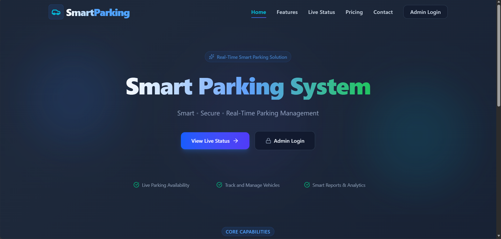
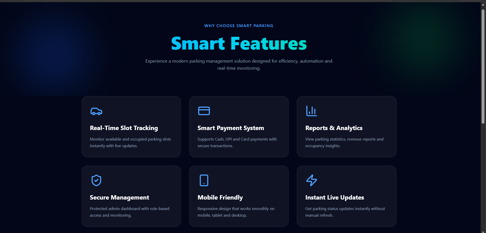
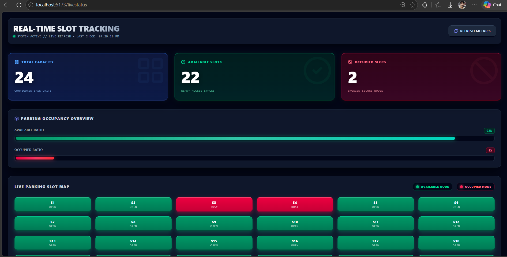
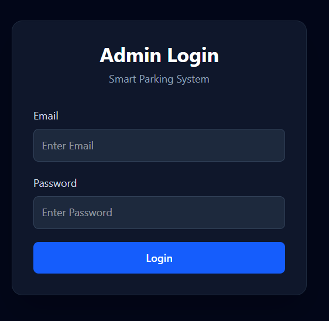
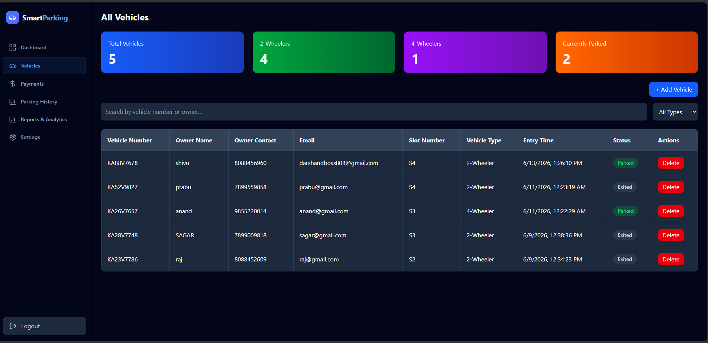
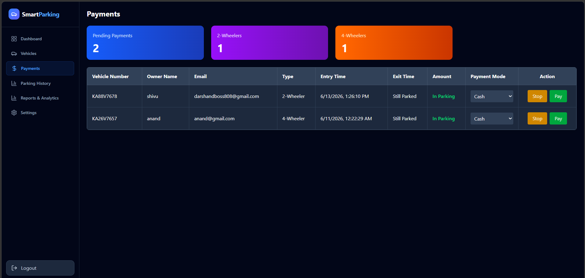
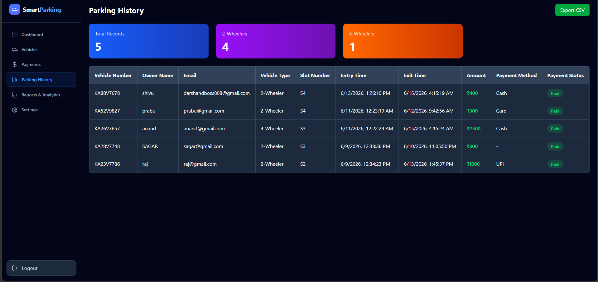
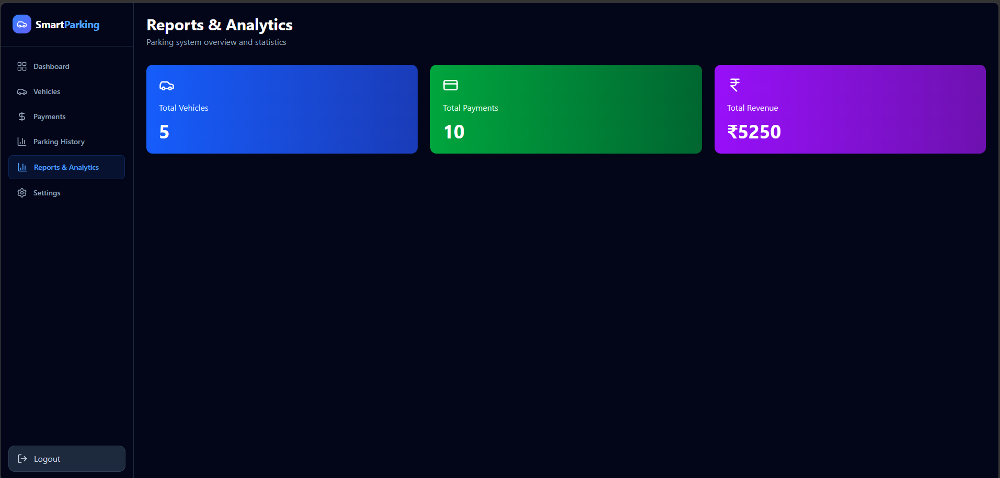
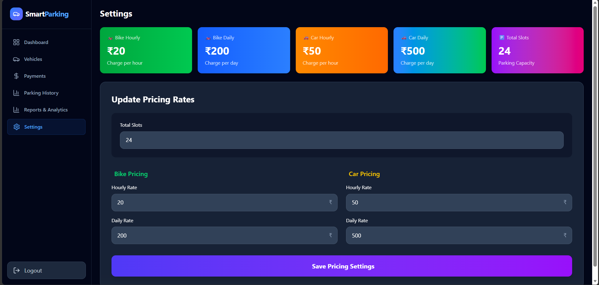

# Smart Parking Management System

## Overview

The Smart Parking Management System is a full-stack web application developed to simplify vehicle parking management through a modern digital platform. The system enables users to view parking availability, reserve parking slots, manage vehicle records, track parking history, and perform secure administrative operations through a centralized dashboard.

The application provides a user-friendly interface for both customers and administrators, helping improve parking efficiency, reduce manual effort, and enhance parking space utilization.

---

## Live Deployment

### Frontend

Netlify Deployment:
https://vehicle-parking-management-system.netlify.app

### Backend

Render Deployment:
https://smart-parking-system-f269.onrender.com

---

## Project Objectives

* Digitize traditional parking management.
* Monitor parking slot availability in real time.
* Enable online parking slot booking.
* Manage vehicle entry and exit records.
* Generate parking reports and history.
* Provide an administrative dashboard for complete parking management.
* Improve user experience through an intuitive interface.

---

# Features

## User Features

* User Registration
* User Login Authentication
* Real-Time Parking Slot Availability
* Parking Slot Booking
* Vehicle Information Management
* Parking Status Tracking
* Responsive User Interface
* Dynamic Pricing Display

## Admin Features

* Secure Admin Login
* Dashboard Analytics
* Vehicle Management
* Parking Slot Management
* Parking History Monitoring
* Payment Tracking
* Report Generation
* System Settings Management
* Live Parking Status Monitoring

---

# System Architecture

Frontend (React + Vite)
↓
REST API Communication
↓
Backend (Node.js + Express.js)
↓
MongoDB Atlas Database

## Screenshots

### Home Page

### Features

### Live Status

### Admin Login

### Dashboard

### Payment

### Parking History

### Report and Analysis

### Settings

---

# Technology Stack

## Frontend Technologies

* React.js
* Vite
* React Router DOM
* Axios
* Material UI (MUI)
* Tailwind CSS
* Lucide React Icons

## Backend Technologies

* Node.js
* Express.js
* JWT Authentication
* Nodemailer

## Database

* MongoDB Atlas
* Mongoose ODM

## Version Control

* Git
* GitHub

## Deployment Platforms

### Frontend Hosting

* Netlify

### Backend Hosting

* Render

### Database Hosting

* MongoDB Atlas

---

# Folder Structure

smart-parking-system/

├── frontend/

│   ├── public/

│   ├── src/

│   ├── package.json

│   └── vite.config.js

│

├── backend/

│   ├── config/

│   ├── controllers/

│   ├── middleware/

│   ├── models/

│   ├── routes/

│   ├── services/

│   ├── utils/

│   ├── server.js

│   └── package.json

│

└── README.md

---

# Installation and Setup

## Clone Repository

git clone <repository-url>

cd smart-parking-system

---

## Backend Setup

Navigate to backend folder:

cd backend

Install dependencies:

npm install

Create .env file and configure:

MONGO_URI=your_mongodb_connection_string

JWT_SECRET=your_secret_key

EMAIL_USER=your_email

EMAIL_PASS=your_email_password

Start backend server:

npm start

---

## Frontend Setup

Navigate to frontend folder:

cd frontend

Install dependencies:

npm install

Start frontend:

npm run dev

Build for production:

npm run build

---

# Deployment Process

## Backend Deployment

Platform: Render

Steps Performed:

1. Connected GitHub Repository.
2. Created Web Service.
3. Configured Environment Variables.
4. Connected MongoDB Atlas.
5. Deployed Backend API.
6. Verified API Availability.

## Frontend Deployment

Platform: Netlify

Steps Performed:

1. Connected GitHub Repository.
2. Configured Base Directory.
3. Configured Build Command.
4. Configured Publish Directory.
5. Fixed React Router Routing using _redirects.
6. Successfully Deployed Frontend.

---

# Security Features

* JWT Based Authentication
* Environment Variable Protection
* Secure Password Handling
* Protected Admin Routes
* MongoDB Cloud Database Security

---

# Future Enhancements

* QR Code Based Parking Entry
* Online Payment Gateway Integration
* Vehicle Number Recognition
* AI-Based Parking Prediction
* SMS Notifications
* Mobile Application Support
* Multi-Parking Location Management

---

# Author

Sagar Managuli

Full Stack MERN Stack Developer

---

# License

This project is developed for educational and learning purposes.
